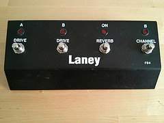
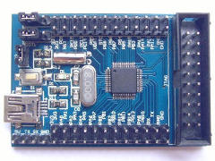

multistomp - A MIDI footswitch firmware for STM32F1-series microcontrollers
===========================================================================

multistomp is a firmware for STM32F1-series microcontrollers that provides
USB-MIDI based switches. Typical multistomp builds are based upon footswitches
providing a means to control MIDI enabled software such as loopers, guitar
amp. simulators and a DAW's play/record/stop buttons.

Whilst multistomp should be easy to port to most STM32F1-series microcontrollers
(and in fact most other STM32 devices with USB device support) it will run most
easily on STM32F103x8 devices.

Quickstart
----------

- Install gcc-arm-embedded compiler toolchain (or similar arm-none-eabi-
  compiler).
- +make+
- +make -C src/bootloader flash+
- +make -C src/multistomp flash+

To flash the bootloader an STLink v2 must be connected to the target
boards JTAG/SWD socket.

To flash the main firmware the microcontroller must be connected to the
host using its own USB socket.

Hardware setup
--------------

The firmware can be easily ported by has been tested on an small STM32F103C8T6
based breakout board. Connections required are:

- USB to host computer
- 4x push-to-make switches connected between GND and PA8, PA9, PA10 and PA3.
- 4x LED connected via a 100 ohm current limiting resistor between GND and
  PA4, PA5, PA6 and PA7.

The LEDs should be mounted such that the LED using PA4 is near to the
switch using PA8 (and so on).

Example hardware
----------------

multistomp was designed around the following pedal board designed for a
Laney amplifier:

The unit has had the wiring loom and original toggle switches removed from
it and replaced with push-to-make switches wired up to an 
http://www.lctech-inc.com/Hardware/Detail.aspx?id=0172e854-77b0-43d5-b300-68e570c914fd[ARM Cortex-M3 STM32F103C8T6 STM32 core board development board] manufactured by http://www.lctech-inc.com[Shenzhen LC Technology (LCTech)]:

